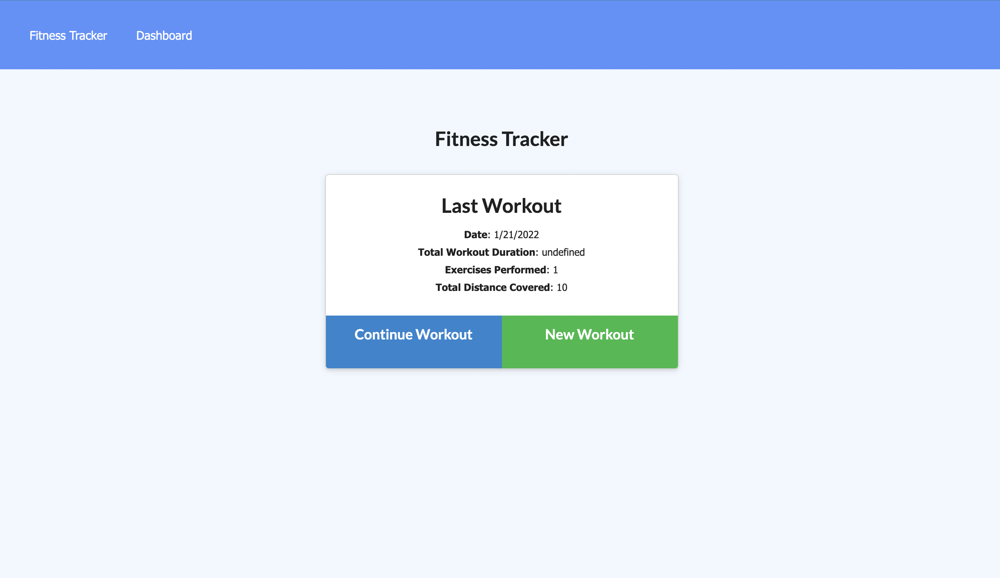

# Fitness-Tracker

_Naomi Smith_

## Table of Contents

- [Overview](#Overview)
- [Build](#Build)
- [Installation](#Installation)
- [Usage](#Usage)
- [Contributing](#Contributing)
- [Questions](#Questions)
- [License](#License)

## Overview

 New Year,New You! The fitness Tracker can help you track your workouts. You will be able to view create and track daily workouts. Ability to log multiple exercises in a workout on a given day. Personal growth is key, this application allows you to track  name, type, weight, sets, reps, and duration of exercise. This will help you see your achievements. If the exercise is a cardio exercise, you will be able to track my distance traveled. Lets meet this new you together and use the Fitness Tracker to help. 

## Build

- [Node](https://nodejs.org/en/about/)
- [Heroku](https://www.heroku.com/what)
- [MongoDB](https://www.mongodb.com/)

## Installation

To install the application you will need nodeJS and use npm install to get all the related packages for this project. In the terminal type npm run develop to interact with the application on your localhost.

## Usage

### Live Webpage

[Live Demo](https://glacial-inlet-54901.herokuapp.com/)

## Contributing

Please reach out via provided Github or Email

## Questions

For any questions about the project, please contact me by either of the following links:

- Email = smithnaomi49@yahoo.com

or visit my GitHub profile:

- Application GitHub - [smithnaomi](https://github.com/smithnaomi/Fitness-Tracker)

## License

---

 This work is licensed under a <a rel="license" href="http://creativecommons.org/licenses/by-sa/4.0/">Creative Commons Attribution-ShareAlike 4.0 International License</a>.
